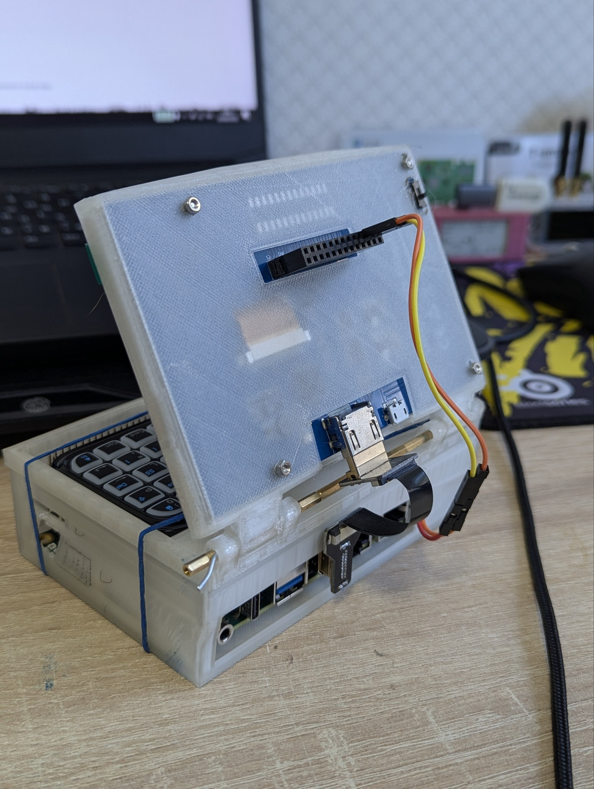
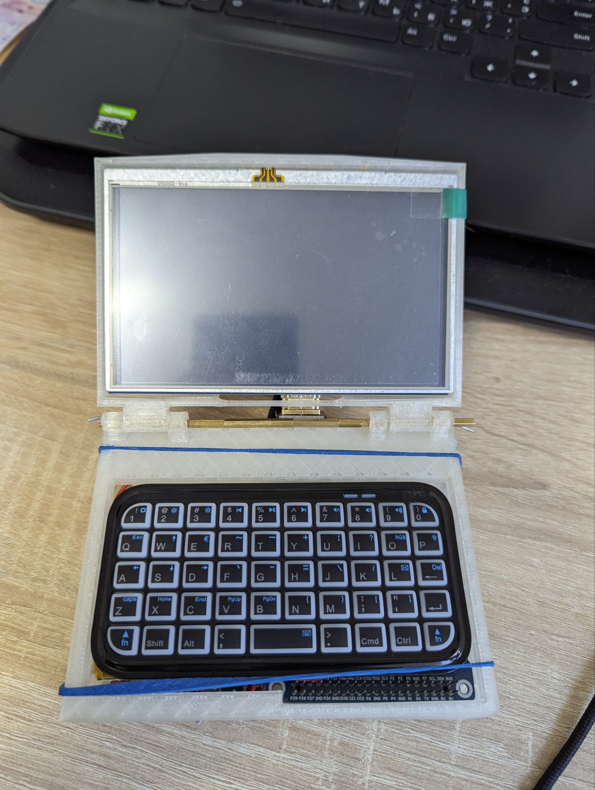
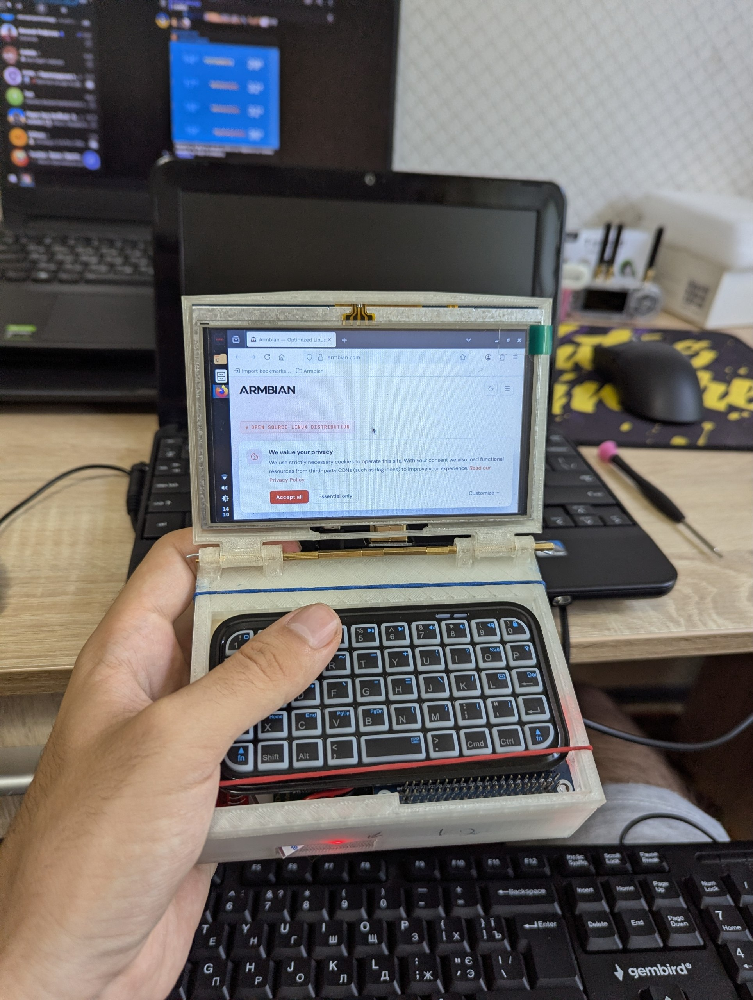
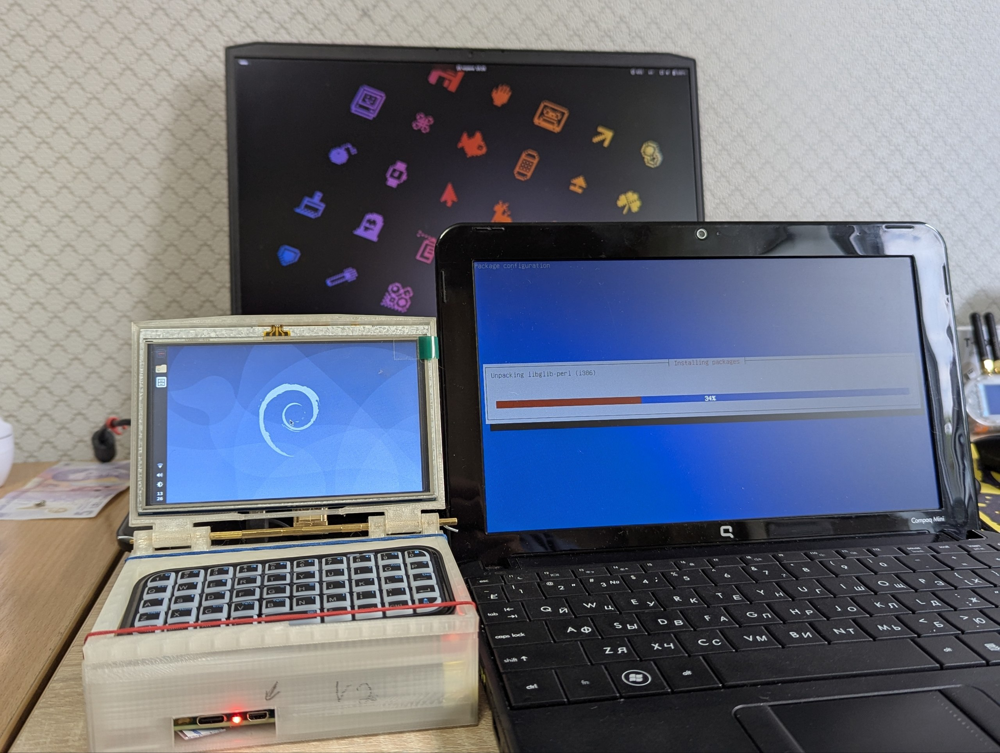
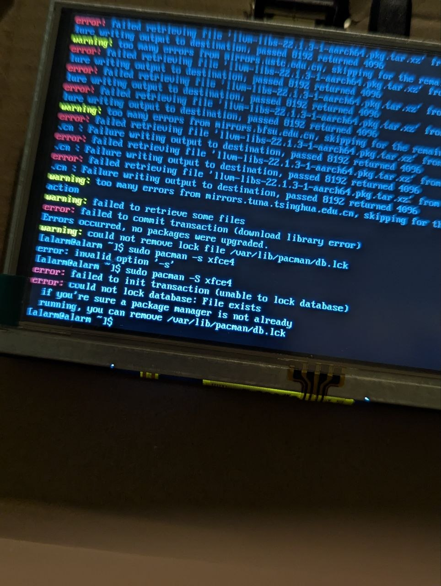

# 💻 Custom Rockchip-Based Cyberdeck (DshanPi-A1)

Welcome to the repository dedicated to the development of my first custom **DIY Cyberdeck**. This project is an open log of my journey into portable computing hardware, embedded Linux configuration, and custom case design. 

As this is my very first experience building such a device, the project is a work in progress. I actively welcome any feedback, technical suggestions, or design ideas in the Issues or Comments sections!

---

## 🚀 Inspiration & Project Goals

The main catalyst for this build was **Pavel Zhovner’s "Flipper One"** project. When the early platform specifications and concepts were made public, it inspired me to try building a compact, single-board terminal utilizing a similar capable architecture.

### Key Design Requirements:
* **No Advanced Soldering Required:** To keep the build accessible and modular, the entire device is constructed using off-the-shelf electronic blocks easily sourced from standard marketplaces like AliExpress.
* **Form Factor:** A highly integrated, ultra-portable clamshell mini-laptop format.
* **Software Utility:** A fully functional, independent Linux environment tailored for development, network analysis, and hardware prototyping.


---

## 🛠️ Hardware Architecture & Bill of Materials (BOM)

Initially, the design was centered around the **Radxa Rock 4D**. However, due to global component shortages affecting RAM availability, the platform was migrated to a less conventional but highly efficient alternative — the **DshanPi-A1**. This board stands out as a budget-friendly option featuring dual RJ45 Gigabit Ethernet ports and an onboard 32GB eMMC module.

### Component Breakdown

| Component | Specifications | Implementation Notes | Visual Reference |
| :--- | :--- | :--- | :--- |
| **SBC (Main Board)** | **DshanPi-A1** (Rockchip) | Budget-friendly processing unit with dual RJ45 ports and 32GB integrated eMMC. |  <br>  |
| **Power Management** | **Raspberry Pi 4 Battery HAT** (SW6106) | Advanced Li-polymer Power Bank solution with built-in hardware protection circuits. Tested and confirmed to work flawlessly with the DshanPi-A1 platform. |  |
| **Battery Cell** | **3.7V 5000mAh 955565 Li-Po** | High-capacity cell equipped with a standard JST PH 2.0mm 2-pin connector. <br> **⚠️ CRITICAL: CHECK THE POLARITY BEFORE ASSEMBLY!!!** | *(Connected to Battery HAT)* |
| **Display** | **5" HDMI LCD Touch Screen** | Resistive TFT display module with an 800x480 native resolution, optimized for compact SBC layouts. |  |
| **Display Interface** | **FPV FPC Flat HDMI Cable** | Ultra-thin Type-A Male to Male flat ribbon cable (10/20/50cm options), essential for tight chassis routing. |  |
| **Cooling System** | **Active Cooler & Heatsink** | Active fan unit originally designed for Raspberry Pi. *Note: The native connector cable is short and requires extensions for clean routing on this board.* |  |

---

## 📐 Enclosure & Form Factor Prototyping

The enclosure is designed from scratch around a classic mini-laptop layout. Below are the chronological stages of early chassis prototyping and physical fitment testing:

### Early Mechanical Shell Prototypes:



### Internal Component Layout & Hinge Mechanism:



### Size Comparison with a Standard 10-inch Netbook:


---

## 🐧 OS Selection & Environment Setup

Finding a fully stable operating system for this specific Rockchip SoC required extensive trial and error across different distributions:

1.  **Armbian (Ubuntu-based):** The stock image lacked multiple essential packages out of the box, leading to tedious dependency resolution issues.
    
2.  **Arch Linux ARM:** Suffered from persistent filesystem stability degradation under heavy workloads, routinely dropping the entire core OS into a `read-only` state.
    
    
4.  **Debian 13 (Trixie / Armbian-optimized):** **Success.** This kernel build proved completely stable on the DshanPi-A1. The base working image can be downloaded directly via the [Armbian Boards Directory](https://armbian.com/boards/dshanpi-a1).
    

### 🛠️ Setting Up the Graphical User Interface (GUI)

The stable Debian image comes as a headless (CLI-only) environment. To configure Xorg and a display manager like `LightDM`, follow these configuration steps:
#### 0. Using armbian-config download XORG GUI
#### 1. Create or Edit the Xorg Configuration File
Open your terminal and initialize a new configuration file for the graphics pipeline:
```bash
sudo nano /etc/X11/xorg.conf.d/20-modesetting.conf
```

#### 2. Add the Video Device Layout
Paste the configuration block below to explicitly assign the `modesetting` driver to the primary DRM/KMS hardware node:
```telegram
Section "Device"
    Identifier  "Rockchip Graphics"
    Driver      "modesetting"
    Option      "kmsdev" "/dev/dri/card1"
EndSection

Section "Screen"
    Identifier  "Default Screen"
    Device      "Rockchip Graphics"
EndSection
```
*Save and exit (`Ctrl+O`, `Enter`, then `Ctrl+X` in Nano).*

#### 3. Configure Permissions for the Display Manager
If Xorg fails to start due to permission restrictions, ensure the display manager user (e.g., `lightdm`) has explicit access to the video, rendering, and TTY device interfaces:
```bash
sudo usermod -aG video,render,tty lightdm
```

#### 4. Launch the Graphical Interface
Restart the display manager service to initialize your desktop environment:
```bash
sudo systemctl restart lightdm
```

---

## ⚠️ Known Issues & Current Limitations

As an early-stage prototype, there are several open hardware and software bugs I am actively addressing:
*   **Limited USB Ports:** The board currently exposes only two usable USB ports.
*   **Bluetooth Driver Stack:** Onboard Bluetooth is not initializing correctly under Debian 13.
*   **Keyboard Cable Routing:** Routing a standard USB Type-C cable has proven difficult. I am planning to transition to an ultra-compact **M5Stack CardKB v1.1 Mini Keyboard (I2C/Serial)** to save space and usb ports.

---

## 🛠️ Next Steps & Future Development

In upcoming iterations of this project, I plan to:
- [ ] Implement custom diagnostic and security utilities.
- [ ] Refine the 3D-printable enclosure models to improve structural integrity and cable management.
- [ ] Resolve onboard wireless/Bluetooth driver constraints.
- [ ] Integrate the CardKB mini keyboard module directly into the lower chassis.

---

## 🔗 Useful Resources & Documentation

*   **Official Hardware Introduction:** [100Ask Rockchip DshanPi-A1 Documentation](https://docs.100ask.net/rockchip/en/docs/DshanPi-A1/intro)
*   **Flashing via Maskrom Mode:** [Step-by-Step eMMC Flashing Guide](https://docs.100ask.net/rockchip/en/docs/DshanPi-A1/part1/01-3_Flash2eMMC/)
*   **Alternative Distributions & Images:** [DshanPi Wiki Resource Acquisition](https://wiki.dshanpi.org/docs/DshanPi-A1/QuickStart/ResourceAcquisition/)

---

💡 *Feel free to star this repository if you find it interesting, and don't hesitate to open an issue if you have questions about the build!*


💡 If you find this open hardware experiment interesting, please give this repository a star ⭐! Feel free to open an issue if you have any questions or want to replicate the build.
