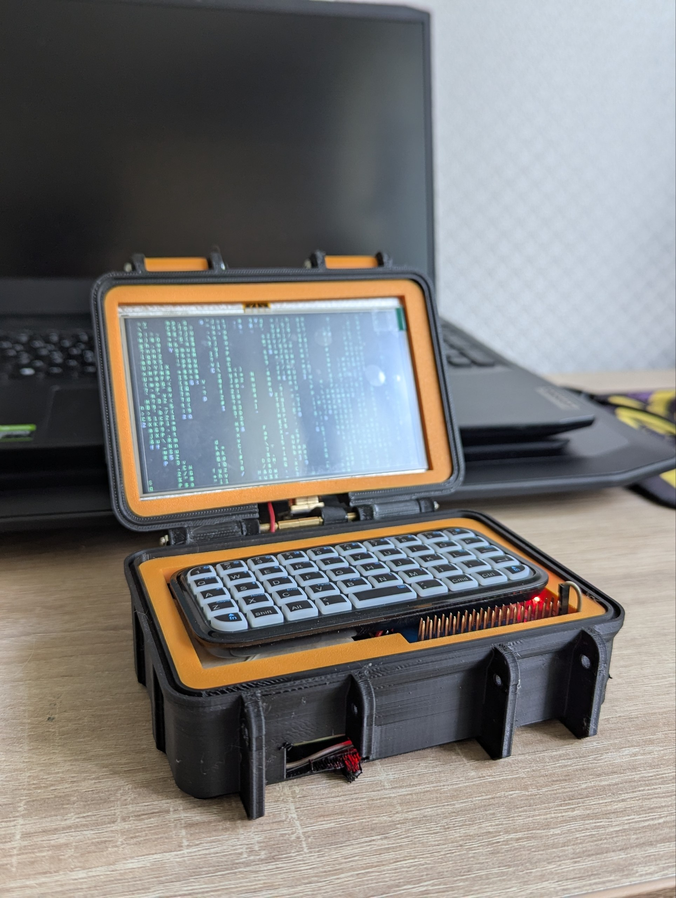
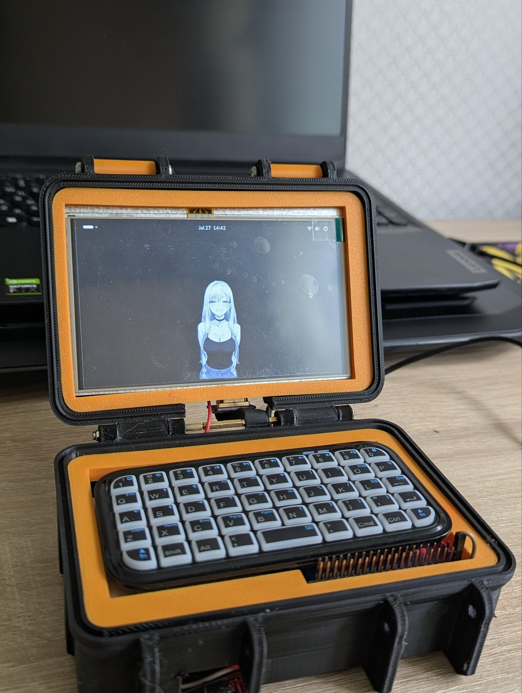
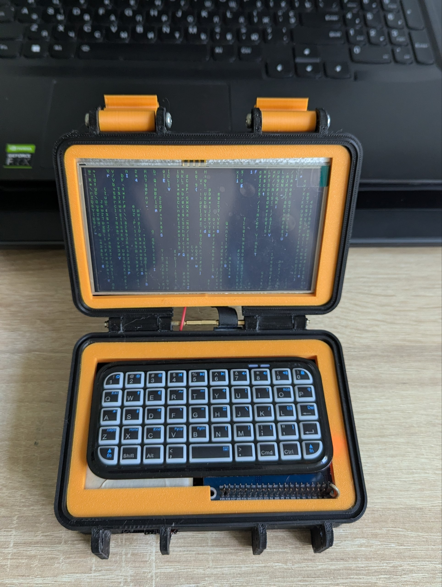
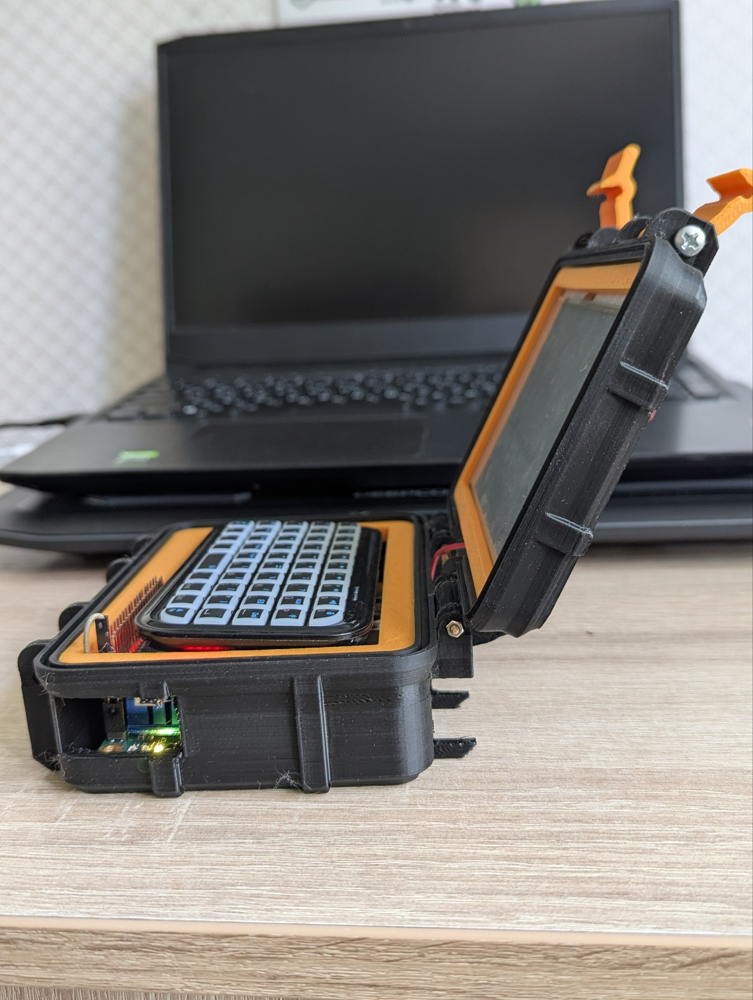
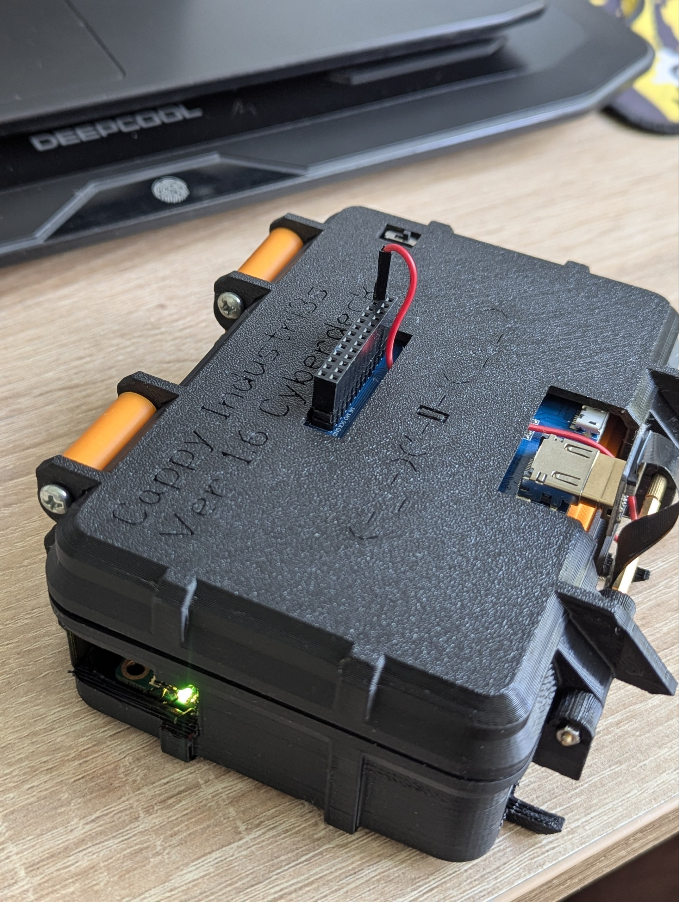
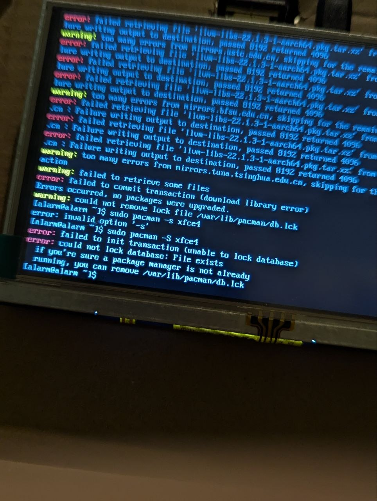

# 💻 Custom Rockchip-Based Cyberdeck (DshanPi-A1)

Welcome to the repository dedicated to the development of my custom **DIY Cyberdeck**. This project is an open log of my journey into portable computing hardware, embedded Linux configuration, and custom case design. 

As this is a work in progress, I actively welcome any feedback, technical suggestions, or design ideas in the Issues or Comments sections!

---

## 🚀 Inspiration & Project Goals

The main catalyst for this build was **Pavel Zhovner’s "Flipper One"** project. When the early platform specifications and concepts were made public, it inspired me to try building a compact, single-board terminal utilizing a similar capable architecture.

### Key Design Requirements:
* **No Advanced Soldering Required:** To keep the build accessible and modular, the entire device is constructed using off-the-shelf electronic blocks easily sourced from standard marketplaces like AliExpress.
* **Form Factor:** A highly integrated, ultra-portable clamshell mini-laptop format.
* **Software Utility:** A fully functional, independent Linux environment tailored for development, network analysis, and hardware prototyping.

---

## 🛠️ Hardware Architecture & Bill of Materials (BOM)

Initially, the design was centered around the **Radxa Rock 4D**. However, due to global component shortages affecting RAM availability, the platform was migrated to a less conventional but highly efficient alternative — the **DshanPi-A1**. This board stands out as a budget-friendly option featuring dual RJ45 Gigabit Ethernet ports and an onboard 32GB eMMC module.

### Component Breakdown

| Component | Specifications | Implementation Notes | Visual Reference |
| :--- | :--- | :--- | :--- |
| **SBC (Main Board)** | **DshanPi-A1** (Rockchip) | Budget-friendly processing unit with dual RJ45 ports and 32GB integrated eMMC. |     |
| **Power Management** | **Raspberry Pi 4 Battery HAT** (SW6106) | Advanced Li-polymer Power Bank solution with built-in hardware protection circuits. Tested and confirmed to work flawlessly with the DshanPi-A1 platform. |  |
| **Battery Cell** | **3.7V 5000mAh 955565 Li-Po** | High-capacity cell equipped with a standard JST PH 2.0mm 2-pin connector.   **⚠️ CRITICAL: CHECK THE POLARITY BEFORE ASSEMBLY!!!** | *(Connected to Battery HAT)* |
| **Display** | **5" HDMI LCD Touch Screen** | Resistive TFT display module with an 800x480 native resolution, optimized for compact SBC layouts. |  |
| **Display Interface** | **FPV FPC Flat HDMI Cable** | Ultra-thin Type-A Male to Male flat ribbon cable (10/20/50cm options), essential for tight chassis routing. |  |
| **Cooling System** | **Active Cooler & Heatsink** | Active fan unit originally designed for Raspberry Pi. *Note: The native connector cable is short and requires extensions for clean routing on this board.* |  |

---

## 📐 Enclosure & Form Factor Prototyping (v2 Build)

The enclosure design has been significantly upgraded to the **v2 chassis revision**, offering improved component fitment, structural rigidity, and layout integration:

### Cyberdeck v2 Physical Assembly & GUI:

### Enclosure Design & Profile Details:

---

## 🐧 OS Selection & Environment Setup

Finding a stable operating system for this board required testing multiple builds and custom configurations:

1. **Flipper OS / Custom OS Builds:** I attempted to build a working system based on **Flipper OS (Flipper One build)** as well as several custom Linux distributions. However, despite extensive efforts, I couldn't get them to operate stably on this platform. I have opened a detailed **Issue** regarding the Flipper One OS porting attempt and compatibility challenges.
2.  **Arch Linux ARM:** Suffered from persistent filesystem stability degradation under heavy workloads, routinely dropping the entire core OS into a `read-only` state.
    
    
2. **Ubuntu 100ask (Current & Stable):** **Success.** Reverted back to the official **Ubuntu 100ask** distribution. This remains the most stable, reliable, and functional OS image for the DshanPi-A1 board.

---

## ⚠️ Known Issues & Current Limitations

As an active prototype, there are several open hardware and software points being worked on:
*   **Rapid Battery Discharge:** The battery drains quickly under active system load, requiring power consumption analysis and power management optimization.
*   **Bluetooth Driver Stack:** Onboard Bluetooth module is not initializing reliably under the current setup.
*   **Keyboard Cable Routing:** Internal space for standard USB cables is tight. Planning a transition to an ultra-compact **M5Stack CardKB v1.1 Mini Keyboard (I2C/Serial)** to save space and streamline internal wiring.

*(Note: The previous USB port limitation has been fully resolved by installing a flex extension cable).*

---

## 🛠️ Next Steps & Future Development

In upcoming iterations of this project, I plan to:
- [ ] Optimize system power efficiency to extend battery life.
- [ ] Resolve onboard Bluetooth driver stability.

---

## 🔗 Useful Resources & Documentation

*   **Official Hardware Introduction:** [100Ask Rockchip DshanPi-A1 Documentation](https://docs.100ask.net/rockchip/en/docs/DshanPi-A1/intro)
*   **Flashing via Maskrom Mode:** [Step-by-Step eMMC Flashing Guide](https://docs.100ask.net/rockchip/en/docs/DshanPi-A1/part1/01-3_Flash2eMMC/)
*   **Alternative Distributions & Images:** [DshanPi Wiki Resource Acquisition](https://wiki.dshanpi.org/docs/DshanPi-A1/QuickStart/ResourceAcquisition/)

---

💡 *If you find this open hardware experiment interesting, please give this repository a star ⭐! Feel free to open an issue if you have any questions or suggestions.*